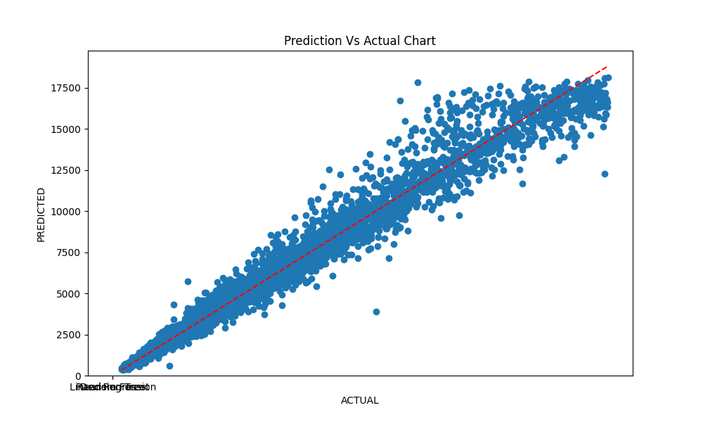

# 💎 Diamond Price Prediction Engine

An end-to-end Machine Learning pipeline and web service that predicts diamond prices with **97%+ accuracy** using physical and quality attributes.

## 🚀 Live Demo
https://diamond-price-prediction-vgzryjfappsxuxdrup2p3m.streamlit.app/

## 🛠️ Technical Stack
* **Language:** Python 3.x
* **Modeling:** Scikit-Learn (Random Forest Regressor)
* **Interface:** Streamlit
* **Data Processing:** Pandas, NumPy
* **Deployment:** Streamlit Community Cloud

## 📈 Model Evolution & Optimization
This project underwent significant optimization to reach production standards:

| Metric | Initial Model | Optimized Model (v2) |
| :--- | :--- | :--- |
| **Algorithm** | Linear Regression | Random Forest (Tuned) |
| **R² Score** | 0.88 | **0.992** |
| **Consistency (Std Dev)** | 0.012 | **0.0002** |
| **Feature Set** | 9 Features | 7 Optimized Features |

### Optimization Highlights:
* **Log Transformation:** Applied `np.log1p` to the target variable to handle price skewness.
* **Feature Engineering:** Dropped low-importance features (`depth`, `table`) to reduce model complexity and improve user experience.
* **Hyperparameter Tuning:** Used `GridSearchCV` to optimize tree depth and estimators.
* **Model Compression:** Pruned decision trees to keep the model size under 25MB for efficient cloud hosting.

## 📊 Visualizations
| Feature Importance | Prediction vs Actual |
| :---: | :---: |
|  |  |

## 💻 How to Run Locally
1. Clone the repo: `git clone https://github.com/Praj-maghiman/diamond-price-prediction.git`
2. Install dependencies: `pip install -r requirements.txt`
3. Run the app: `streamlit run app.py`

---
